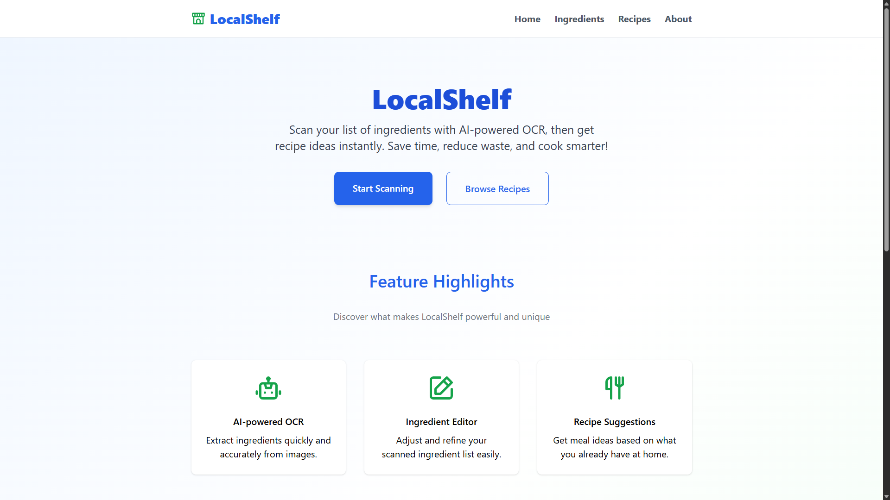

# LocalShelf

A side project to learn Nuxt, Vue, and TailwindCSS through building a web app.



## About the Project

### Tech Stack

- Nuxt: Full-stack Vue.js framework for building web apps.
- Pinia: store management for Vue 3.
- TailwindCSS: CSS utility framework for rapid UI design.

## Live Demo

This side project is running on Vercel and is available at <https://local-shelf.vercel.app/>

## Getting Started

To run the project locally:

```bash
# Clone the repo
git clone https://github.com/bathienle/local-shelf.git
cd local-shelf

# Install dependencies
npm install

# Start the development server
npm run dev
```

## License

Apache-2.0
